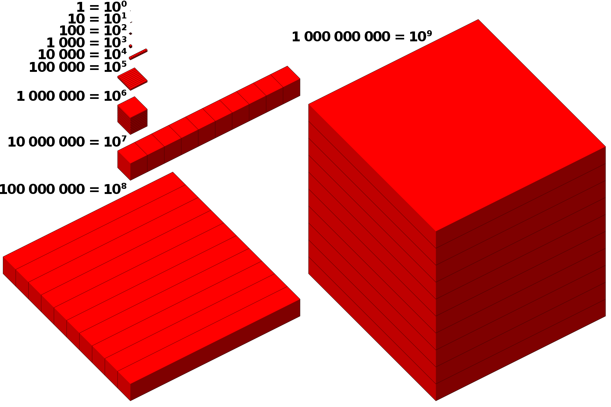

# Decimal

## В данном проекте представлена реализация типа даннах из C# decimal, на языке C , с помощью использования побитовых операций.

Понятие числа типа decimal реализовано через структуру хранящую в себе массив из 4-x элементов типа `int` и одного элемента типа `value_type_t`, обозначающего что это за значение.

## Структура decimal

1) Первые три элемента массива bits (96 бит) - хранят в себе нормализированную форму числа.
2) Четвёртый элемент массва bits хранит характеристику числа, а именно знак на 31 позиции бита и показатель степени.
3) `value_type_t` - указывает обычное ли это число (D_NORMAL_VALUE), nan (D_NAN), infinity (D_INFINITY), -infinity(D_NEGATIVE_INFINITY) или же число преведённое в дополнительный код (D_DOP_CODE).
4) В данное проекте определено `TRUE` - 0, а `FALSE` - 1.

Само число типа decimal расчитывается по формуле: `(нормализированная форма)*(-10^(показатель степени))` или `N*(-10^(M))`.

## Функции для decimal

Основне функции для работы с числами типа decimal разделены на 4 логические блока: арифметика, сравнения, конверторы и специальные функции.

### Арифметика

 1) `decimal decimal_add(decimal x, decimal y)` - возвращает x + y .
 2) `decimal decimal_sub(decimal x, decimal y)` - возвращает x - y .
 3) `decimal decimal_mul(decimal x, decimal y)` - возвращает x * y .
 4) `decimal decimal_div(decimal x, decimal y)` - возвращает x / y .
 5) `decimal decimal_mod(decimal x, decimal y)` - возвращает x mod y (остаток деления) .

### Сравнения 

 1) `int is_less(decimal x, decimal y)` - возвращает 0, если x < y, иначе 1.
 2) `int is_less_or_equal(decimal x, decimal y)` - возвращает 0, если x <= y, иначе 1.
 3) `int is_greater(decimal x, decimal y)` - возвращает 0, если x > y, иначе 1.
 4) `int is_greater_or_equal(decimal x, decimal y)` - возвращает 0, если x >= y, иначе 1.
 5) `int is_equal(decimal x, decimal y)` - возвращает 0, если x == y, иначе 1.
 6) `int is_not_equal(decimal x, decimal y)` - возвращает 0, если x != y, иначе 1.

### Конверторы

 1) `int from_int_to_decimal(int src, decimal* dst)` - переводит переданное число int в decimal и возвращает 0 в случае удачной конвертации, 1 в случае неудачи. 
 2) `int from_float_to_decimal(float src, decimal* dst)` - переводит переданное число float в decimal и и возвращает 0 в случае удачной конвертации, 1 в случае неудачи. 
 3) `int from_decimal_to_int(decimal src, int* dst)` - переводит переданное число decimal в int и возвращает 0 в случае удачной конвертации, 1 в случае неудачи. 
 4) `int from_decimal_to_float(decimal src, float* dst)` - переводит переданное число decimal во float и возвращает 0 в случае удачной конвертации, 1 в случае неудачи. 

### Специальные функции 

 1) `decimal decimal_floor(decimal dec)` - возвращает результат округления dec до ближайшего целого числа, которое меньше, либо равно dec. 
 2) `decimal decimal_round(decimal dec)` - - возвращает результат округления dec до ближайшего целого числа.
 3) `decimal decimal_truncate(decimal dec)` - возвращает целую часть переданного dec.
 4) `decimal decimal_negate(decimal dec)` - возвращает dec умноженный на -1.

## Примеры

 1) `decimal dec = {0x74ED9B81, 0xE758E637, 0x00000019, 0x00060000, 0x0}` - это 477838928989310.000001 .
 2) `decimal dec = {0x0, 0x0, 0x0, 0x0, 0x1}` - это inf.
 3) `decimal dec = {0x0, 0x0, 0x0, 0x0, 0x2}` - это -inf.
 4) `decimal dec = {0x0, 0x0, 0x0, 0x0, 0x3}` - это nan.
 5) `decimal dec = {0x000007F2, 0x00000000, 0x00000000, 0x80080000, 0x0}` - это -0.00002034 .
 6) `decimal dec = {0xFFFFFFFF, 0xFFFFFFFF, 0xFFFFFFFF, 0x0, 0x0}` - это 79228162514264337593543950335 .
 7) `decimal dec = {0x00000001, 0x00000000, 0x00000000, 0x001C0000, 0x0}` - это 1e-28.

Сборка проекта осуществляется на ваше усмотрение. В моём случае сборка с помощью gcc 9.2.0 и Makefile на Linux.

Makefile, как и все исходные материалы лежит в папке src.